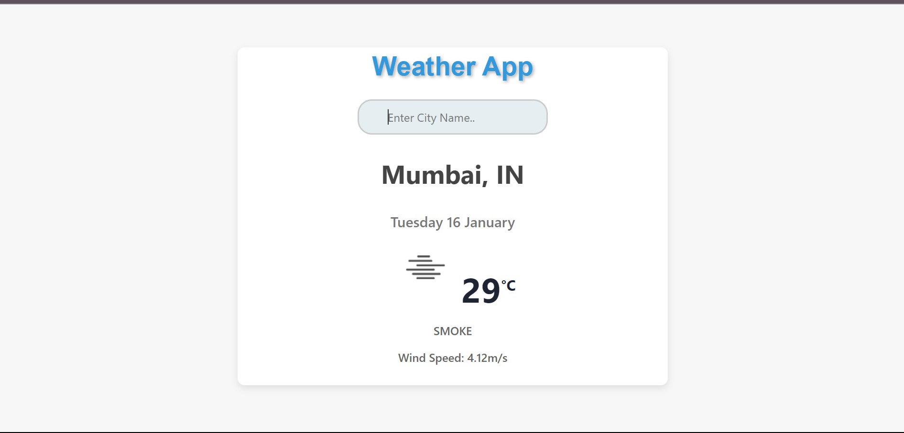

# MyWeatherApp

MyWeatherApp is a simple React-based weather application that allows users to check the current weather conditions of a specific city. It uses the OpenWeatherMap API to fetch weather data and displays it in a user-friendly interface.

## Features

- **Real-time Weather Information:** Get the latest weather information for any city.
- **Dynamic Background:** The background changes based on the current weather conditions.
- **Responsive Design:** Accessible on various devices for a seamless user experience.

## Screenshots



## Usage

1. **Clone the repository:**

    ```bash
    git clone https://github.com/ShantanuPayal/weather-app.git
    ```

2. **Install dependencies:**

    ```bash
    cd weather-app
    npm install
    ```

3. **Run the application:**

    ```bash
    npm start
    ```

4. **Open your browser and visit [http://localhost:3000](http://localhost:3000) to view the app.**

## Technologies Used

- React
- Axios
- [react-loader-spinner](https://www.npmjs.com/package/react-loader-spinner)
- [react-fontawesome](https://www.npmjs.com/package/@fortawesome/react-fontawesome)

## API Key

Please note that you need to provide your own API key from OpenWeatherMap. Replace the `api_key` variable in the `search` function of `App.js` with your API key.


## Acknowledgments

- Thanks to OpenWeatherMap for providing the weather data.
- Special thanks to [react-loader-spinner](https://www.npmjs.com/package/react-loader-spinner) and [react-fontawesome](https://www.npmjs.com/package/@fortawesome/react-fontawesome) for their useful components.
- GeeksforGeeks for the insipiration and reference

Feel free to contribute, open issues, and provide feedback!
